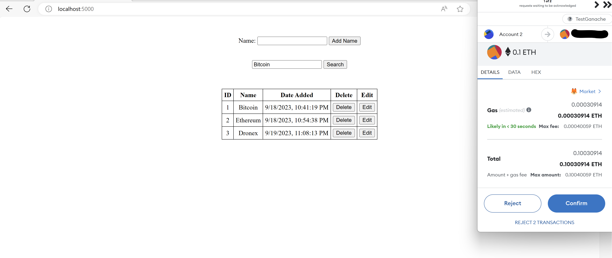

# EtherDB

[](https://opensource.org/licenses/MIT)

Empowering Decentralized Data Management with Blockchain.

## Table of Contents
- [Introduction](#introduction)
- [Features](#features)
- [Getting Started](#getting-started)
  - [Database manager installation](#database-manager-installation)
  - [Database generation](#database-generation)
  - [Get Ganache](#get-ganache)
  - [Get Metamask](#get-metamask)
  - [Get Truffle](#get-truffle)
  - [Prerequisites](#prerequisites)
- [Usage](#usage)
- [References](#references)
- [License](#license)

## Introduction


Welcome to EtherDB, a decentralized application built on blockchain technology that changes the way to interact with 
databases. This DApp leverages the power of blockchain to provide secure, transparent, and efficient database operations, 
all while enabling users to perform database operations upon the payment of a fee.

## Features

- Utilizes blockchain technology for data security and transparency.
- While the database itself resides on a remote server, the blockchain ensures that database 
  operations are recorded in a decentralized and tamper-resistant manner.
- Provides robustness and data integrity, even when the database is hosted centrally.

## Getting Started

### Prerequisites

- Truffle v5.9.4 (core: 5.9.4)
- Node v18.16.0
- A working installation of [XAMPP](https://www.aopachefriends.org/download.html)
- A running version of Ganache
- Metamask extension added to you favourite browser

### Database manager installation

Follow the instructions to install and setup XAMPP on your machine. 
XAMPP provides a relational database management system (RDBMS) that allows you to store, retrieve, and manage data in a structured format.

### Database generation
Following the installation, you'll find a set of instructions below for creating the database utilized by the EtherDB code.

```bash
# start the database manager
sudo /opt/lampp/lampp start
# enter the cli
sudo /opt/lampp/bin/mysql -u root
# create a new database
CREATE DATABASE EtherClients;
# switch to the new database
USE EtherClients;
# create a new table called "names" 
CREATE TABLE names (
    id INT AUTO_INCREMENT PRIMARY KEY,
    name VARCHAR(255),
    date_added DATETIME
);
# create the user with the specified privileges
CREATE USER 'EtherUser'@'localhost' IDENTIFIED BY 'test1234';
GRANT ALL PRIVILEGES ON EtherClients.* TO 'EtherUser'@'localhost';
FLUSH PRIVILEGES;
# select the new database
USE EtherClients;
# insert a new entry into the "names" table
INSERT INTO names (name, date_added) VALUES ('Bitcoin', NOW());
# exit MySQL
exit;
```

### Get Ganache

Ganache is a personal blockchain for Ethereum development. 
Download the right image for your OS from [here](https://trufflesuite.com/ganache/) and launch it.

### Get Metamask

Metamask is a popular and widely used cryptocurrency wallet and browser extension that provides users with a user-friendly
 interface to interact with decentralized applications (DApps) on the Ethereum(-like) blockchain. 
Add Metamask to your browser [link](https://support.metamask.io/hc/en-us/articles/360015489531-Getting-Started-With-MetaMask).

### Connect Metamask and Ganache

In order to interact properly with EtherDB and be able to complete transactions, Metamask needs to be connected with the private blockchain
spinned by Ganache. Follow these [instructions](https://trufflesuite.com/docs/truffle/how-to/truffle-with-metamask/) 
to setup your local testnet.

### Get Truffle

Truffle is a suite of tools for smart contract development. Follow the [documentation](https://trufflesuite.com/docs/truffle/how-to/install/)
to have it installed globally on your machine.


## Usage

Clone th repository. Move into the EtherDB directory and run the following to install the right environment
```bash
npm run install
```
In order to compile the smart contract and to migrate the contract tp your local blockchain
```bash
truffle compile
truffle migrate --reset
```
Finally, to start the DApp
```bash
npm run start
```
Open 'localhost:5000' in your browser, sign in with Metamask, and you'll be ready to interact with both the Database and the contract.

 


## References

-  [Video](https://www.youtube.com/watch?v=vrj9AohVhPA)
-  [Author](https://www.youtube.com/@NsquaredCoding)

## License

This project is licensed under the MIT License - see the [LICENSE](LICENSE) file for details.

